# Dattorro Plate Reverb Algorithm

**Reference:** Dattorro, "Effect Design Part 1" (JAES, 1997) @ 29,761 Hz

```mermaid
flowchart LR
    INPUT["Mono In"] --> PREDELAY["Pre-Delay"] --> BW["Bandwidth LP"]
    BW --> AP1["AP 142"] --> AP2["AP 107"] --> AP3["AP 379"] --> AP4["AP 277"]
    AP4 --> SPLIT((" "))

    SPLIT --> L_SUM((" + "))
    SPLIT --> R_SUM((" + "))

    subgraph LEFT["Left Tank Half"]
        direction TB
        L_SUM --> L_AP1["Decay AP1<br/>672 smp, g=-0.70"]
        L_AP1 --> L_DL1["Delay 4453 smp<br/>(+LFO)"]
        L_DL1 --> L_DAMP["Damping LP"]
        L_DAMP --> L_DEC["x decay"]
        L_DEC --> L_AP2["Decay AP2<br/>1800 smp, g=+0.50"]
        L_AP2 --> L_DL2["Delay 3720 smp"]
        L_DL2 --> L_DC["DC Block"]
    end

    subgraph RIGHT["Right Tank Half"]
        direction TB
        R_SUM --> R_AP1["Decay AP1<br/>908 smp, g=-0.70"]
        R_AP1 --> R_DL1["Delay 4217 smp<br/>(+LFO 180)"]
        R_DL1 --> R_DAMP["Damping LP"]
        R_DAMP --> R_DEC["x decay"]
        R_DEC --> R_AP2["Decay AP2<br/>2656 smp, g=+0.50"]
        R_AP2 --> R_DL2["Delay 3163 smp"]
        R_DL2 --> R_DC["DC Block"]
    end

    L_DC -- "x decay" --> R_SUM
    R_DC -- "x decay" --> L_SUM

    L_DC --> TAPS_L["Output Taps"]
    R_DC --> TAPS_R["Output Taps"]
    TAPS_L --> OUT_L["Left Out"]
    TAPS_R --> OUT_R["Right Out"]

    style LEFT fill:#2a2a4e,color:#eee
    style RIGHT fill:#2a2a4e,color:#eee
```

Input diffuser coefficients: AP 1-2 = 0.750, AP 3-4 = 0.625. Cross-feedback between tank halves forms the figure-8 loop. Output taps (7 per channel) are drawn from delay lines and decay AP2s in both halves.
