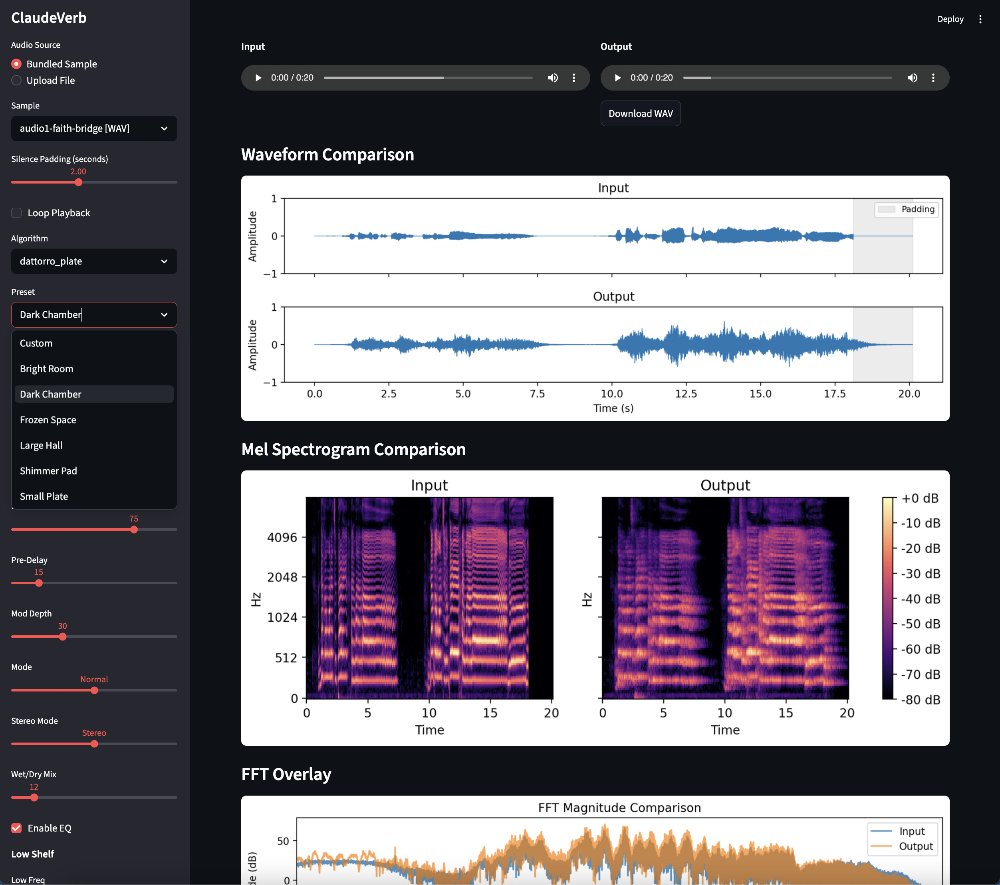
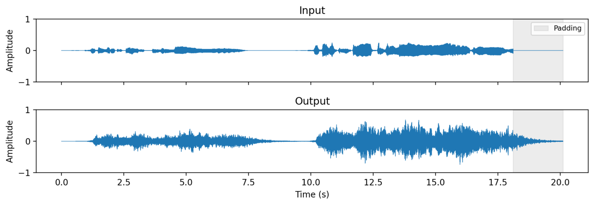
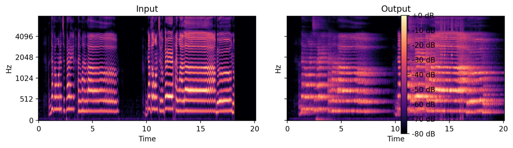
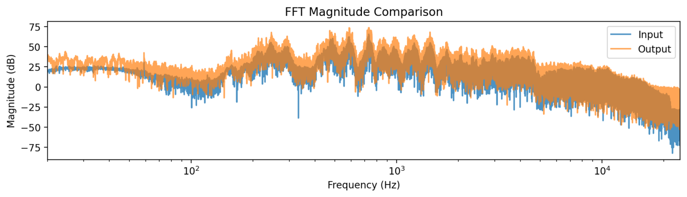
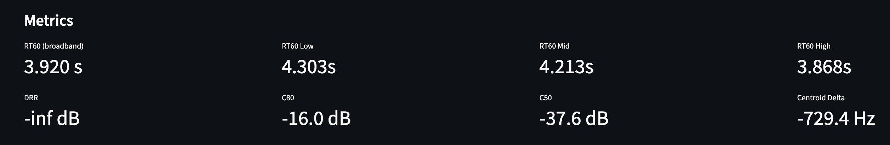
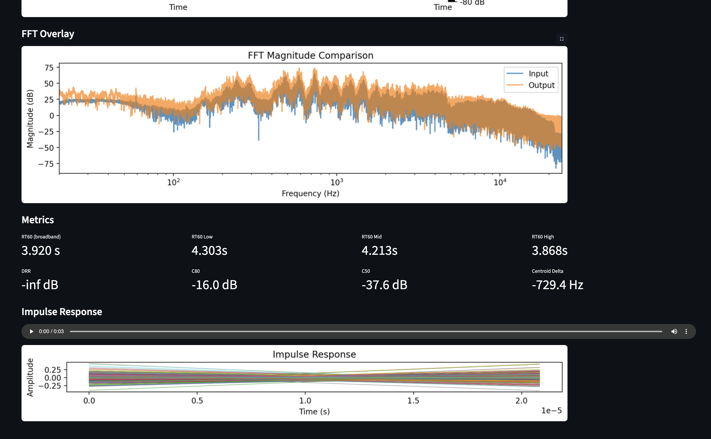

# claudeverb

Python DSP workbench for evaluating and comparing reverb algorithms for use on microprocessors and audio plugins at 48 kHz.
Outputs mel spectrograms, frequency analysis, and acoustic metrics (RT60, DRR, C80) and allows for A/B comparison of reverb algorithms.

Support for features like varying the wet/dry ratio for listening tests, algorithm exploration, C code translation for hardware
devices, and a mix of various modern and vintage digital reverb algorithms, via a web interface.



Algorithms are designed for eventual C port to the
[STM32 Daisy Seed](https://electro-smith.com/daisy) embedded audio platform.

The primary goal of the workbench is to progressively add features to make reverb algorithm development through listening tests on a Mac
and export the tweaked algorithms to the STM32 microcontrollers for guitar pedal use.  We will use LLMs to help design and tweak the
algorithms we develop.

## Setup

```bash
pip install -e ".[dev]"
```

## Running

```bash
# Web UI (Streamlit)
streamlit run claudeverb/streamlit_app.py

# Desktop UI (PySide6)
python main.py

# Tests
pytest
```

## Algorithms

| Algorithm | Status   | Description |
|-----------|----------|-------------|
| Freeverb | ✅ Done | Jezar's Schroeder-Moorer design (8 comb + 4 allpass/channel) |
| FDN Reverbs | 🚧 Stub | Samples of various FDN reverbs, including 8x8 Hadamand reverb similar to Bricasti M7's 16x16 mix matrix reverb |
| Plate (Dattorro) | ✅ Done | Dattorro figure-eight plate reverb |

Other algorithms based on FDN, Dattoro, Neunaber Web etc. and similar algorithms should be added over time.

## Tests

Multiple tests should test that the algorithms function as designed. Tests can be a mixture of audio file tests and
impulse response tests, and any other audio signal / DSP tests as appropriate.

The equivalent commercial algorithms loaded on this machine as .AU audio units for use in Logic should also be able to be used for 
testing that the generated c/c++ code from this tool gives a comparable answer to a commercial algorithmn.

## C Export (Daisy Seed)

NOTE: this section can be changed if needed for the new implementations, so use this as a rough guide only.

### Example for FreeVerb algorithm

```python
from claudeverb.algorithms.freeverb import Freeverb, FreeverbParams
from claudeverb.export import export_algorithm

algo = Freeverb(FreeverbParams(room_size=0.7))
export_algorithm(algo, output_dir="./c_export")
```

Generates `Freeverb.h` and `Freeverb.c` targeting the libDaisy framework.

## Screenshots










